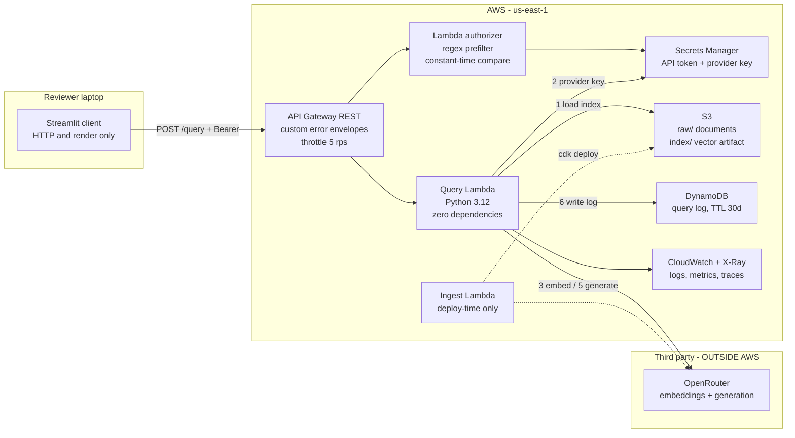

# AWS-Native Knowledge Base Agent

A retrieval-augmented question-answering service: infrastructure defined in AWS CDK, an
authenticated API on AWS, grounded answers with **verified** citations, and a local
Streamlit client that talks to it with a bearer token.

Built as a take-home from a reference prototype. The prototype ran everything in one
Streamlit process on a laptop; this moves the retrieval, the prompting and the model access
behind an authenticated API where they can be permissioned, logged and tested.

**Deployed and measured**, not just synthesized: 11 evaluation questions, 99 tests,
~2.4 s p50 latency, ~$0.002 per query, ~$2.10/month of AWS cost against a $20 budget.

---

## Quick start

Prerequisites: Node 20+, Python 3.11+, AWS CLI configured, and an OpenRouter API key.

```bash
npm run install:infra          # CDK dependencies
npm run install:client         # Streamlit and requests

npm run deploy -- -c prefix=kbagent-<your-initials>
```

The first deploy **cannot** seed the knowledge base — CDK creates the provider key secret in
the same deployment, so there is nothing to embed with yet. The trigger detects that and
exits cleanly rather than rolling back the stack. Two more commands finish the job:

```bash
aws secretsmanager put-secret-value \
  --secret-id kbagent-<initials>-dev/provider-api-key \
  --secret-string 'sk-or-...'

npm run seed -- --stack kbagent-<initials>-dev
```

Then the client:

```bash
npm run configure -- --stack kbagent-<initials>-dev   # writes .streamlit/secrets.toml
npm run client
```

`configure` reads the API URL from the stack outputs and the token from Secrets Manager and
writes them straight to the file. The token never passes through a clipboard or a shell
history.

Verify the whole contract in one command:

```bash
python scripts/smoke_test.py --stack kbagent-<initials>-dev
```

Or by hand:

```bash
API=$(aws cloudformation describe-stacks --stack-name kbagent-<initials>-dev \
      --query "Stacks[0].Outputs[?OutputKey=='ApiBaseUrl'].OutputValue" --output text)
TOKEN=$(aws secretsmanager get-secret-value --secret-id kbagent-<initials>-dev/api-token \
      --query SecretString --output text)

curl -i "$API/health"                                    # 401 -- auth is not optional
curl -s -H "Authorization: Bearer $TOKEN" "$API/health"  # 200

curl -s -X POST "$API/query" \
  -H "Authorization: Bearer $TOKEN" -H "Content-Type: application/json" \
  -d '{"question":"What is the refund policy for enterprise customers?","top_k":5}'
```

### Deployment options

All are CDK context flags: `npm run deploy -- -c prefix=kbagent-mc -c alertEmail=you@example.com`.
Only `prefix` is needed for a first deploy; the rest have working defaults.

| Flag | Default | What it does |
|---|---|---|
| `prefix` | `kbagent` | Names every resource. 3–24 lowercase characters, because it becomes part of an S3 bucket name. Validated at synth, not at deploy, so a bad value fails in seconds rather than mid-rollback. |
| `alertEmail` | *none* | Subscribes an address to the alarm topic. **Without it the three alarms deploy with no action**: they evaluate and go red on the dashboard, but nobody is told. No topic is created rather than an orphan one nobody is subscribed to. |
| `env` | `dev` | Selects the environment profile — log retention, throttling, removal policy. |
| `provider` | `openrouter` | `openrouter` or `bedrock`. This is the [ADR-09](docs/adr/0009-model-provider-abstraction.md) seam: `-c provider=bedrock` returns every model call to AWS with no code change. The Bedrock path is written against the documented API and covered by a mocked client — it could not be exercised for real, since losing Bedrock is what caused the ADR. |
| `generationModel` / `embeddingModel` | per provider | Override the model slugs without editing code. |
| `reservedConcurrency` | *unset* | Caps concurrent Lambda executions. **Opt-in on purpose**: a fresh AWS account has an account limit of 10, and reserving any of it fails the deploy. Set it in an account with real headroom. |
| `cloudWatchRole` | `true` | Creates the account-level API Gateway logging role. Pass `-c cloudWatchRole=false` in a shared account where it already exists — it is an account-wide singleton, so two stacks both claiming it will collide. |
| `expectedAccount` | *unset* | Refuses to deploy anywhere else. Worth setting once you have more than one account configured. |

The stack declares no `env`, so the same commit deploys to whatever account and region the
credentials point at. To use a second one, add a named profile and pass it through — every
script here accepts `--profile`, and CDK takes it directly:

```bash
npm run deploy    -- --profile <name> -c prefix=kbagent-<initials> -c cloudWatchRole=false
npm run seed      -- --stack kbagent-<initials>-dev --profile <name>
npm run configure -- --stack kbagent-<initials>-dev --profile <name>
npm run smoke     -- --stack kbagent-<initials>-dev --profile <name>
```

`-c cloudWatchRole=false` matters in a shared or sandbox account: the API Gateway logging role
is an account-wide singleton, and claiming one that already exists fails the deploy.

---

## Architecture



Full diagram, with the reasoning annotated on it:
[Lucid](https://lucid.app/lucidchart/cb888b4a-c234-4912-90e3-05d8b2fe4895/view). The Mermaid
above is the version-controlled copy; it renders on GitHub without leaving the repository.

### The decisions worth explaining

Each is an [ADR](docs/adr/); the reasoning is there in full.

| Decision | Why |
|---|---|
| **In-memory vector index, no OpenSearch or RDS** | AOSS is prohibited by the brief and bills continuous base capacity; a micro RDS would consume ~70% of a $20 budget. The index is a versioned artifact in S3 loaded into Lambda memory. **Retrieval costs $0.00.** |
| **Exact cosine search in pure Python, no FAISS** | 52 chunks × 512 dims is 3–5 ms measured, against ~2,000 ms for the generation call. Retrieval is 0.2% of latency; an ANN index would optimise the wrong thing while adding a native dependency that forces Docker into every deployment. |
| **API Gateway REST, not the cheaper HTTP API** | HTTP API returns a bare `{"message":"Forbidden"}` for a denied authorizer with no way to change it. Gateway Responses exist only on REST, and they are what makes every error — including 401 and 429 — carry the documented envelope with a `request_id`. The price difference is $0.006 at this volume. |
| **Lambda authorizer, not an API Gateway API key** | API keys identify callers for usage plans; AWS documents them as not being an authentication mechanism. |
| **One stack, four constructs** | Cross-stack references become CloudFormation exports, and CloudFormation refuses to delete a stack whose exports are in use. For a reviewer who deploys and destroys once, that is friction with no benefit. |
| **Model provider behind an interface** | See below — this one was forced by an incident, and it is the most interesting decision in the project. |

### Amazon Bedrock AgentCore

Considered and declined. This is single-step RAG, not an agentic tool loop: AgentCore Runtime
solves long-running multi-step sessions with per-user memory, which this system does not
have, and bills for session time rather than 100 ms of invocation. It was also judged a
service-availability risk in a shared sandbox.

**That risk then materialised** — AgentCore depends on Bedrock, which the sandbox lost access
to. Had it been adopted, the project would be dead. The same reasoning declined Bedrock
Knowledge Bases ([ADR-06](docs/adr/), [ADR-07](docs/adr/)).

It would be the right choice once the agent needs multi-step tool use, sessions beyond
Lambda's 15-minute limit, or per-user memory. At that point the query Lambda becomes a tool
the agent calls, and the rest of the architecture is unchanged.

---

## Data flow: does anything leave AWS?

**Yes, and it is the most important disclosure in this document.**

Retrieved document chunks and the user's question are sent to **OpenRouter**, a third-party
provider, inside the generation prompt. Storage, compute, authentication, logging and the
vector index are entirely within AWS.

This is not the original design. The system was built for Amazon Bedrock — Titan embeddings
and Claude, with data never leaving AWS and IAM instead of an API key. Partway through, the
shared sandbox lost Bedrock access. Verified rather than assumed:

```console
$ aws bedrock-runtime invoke-model --model-id amazon.titan-embed-text-v2:0 ...
An error occurred (ValidationException): Operation not allowed
```

`ValidationException` rather than `AccessDeniedException`, on every model including
embeddings, is the signature of a service control policy denying `bedrock-runtime` at the
organization level — not something fixable from inside the account.

**Mitigations:** the provider key lives in Secrets Manager and never in this repository; the
sample knowledge base contains no personal data; question logging is disabled with
`LOG_QUESTIONS=false`; and `MODEL_PROVIDER=bedrock` returns every model call to AWS. Full
reasoning in [ADR-09](docs/adr/0009-model-provider-abstraction.md).

One capability is genuinely lost: **Bedrock Guardrails** is no longer available as the
content-filtering and PII layer proposed for production hardening.

> A note on the brief's model recommendation: `anthropic.claude-3-haiku-20240307-v1:0` is now
> marked **Legacy** by the provider and unavailable to accounts not already using it. Its
> active successor, Claude Haiku 4.5, is used instead — a verified constraint, not a
> preference. A CDK test fails if the old model id is reintroduced.

---

## API contract

Base URL comes from the `ApiBaseUrl` stack output. **Every route requires
`Authorization: Bearer <token>`**, including `/health` — the brief says the API must not be
publicly callable, and taking that literally has a useful side effect: `curl /health` with no
token returning 401 is the cleanest demonstration that authentication works.

### `POST /query`

```json
{ "question": "What is the refund policy for enterprise customers?",
  "session_id": "optional", "top_k": 5, "style": "standard" }
```

`question` is required, 3–1000 characters. `top_k` defaults to 5, clamped to 1–10. `style`
is `standard` or `simple` and defaults to `standard`. The body is validated **at the
gateway**, so a malformed request never reaches or bills compute.

```json
{
  "answer": "Enterprise customers may request a refund within 30 days of the invoice date [refund-and-cancellation-policy.md#chunk-1] ...",
  "confidence": 0.67,
  "grounding": "medium",
  "sources": [
    { "document_id": "refund-and-cancellation-policy.md",
      "document_title": "Refund and Cancellation Policy",
      "chunk_id": "refund-and-cancellation-policy.md#chunk-1",
      "section": "Refund windows by plan", "page": null,
      "score": 0.6787, "excerpt": "...", "cited": true }
  ],
  "metadata": {
    "provider": "openrouter", "model": "anthropic/claude-haiku-4.5",
    "embedding_model": "openai/text-embedding-3-small",
    "retrieval_strategy": "in_memory_cosine_topk",
    "request_id": "b5a8f6d8-...", "session_id": "...",
    "kb_version": "2026-09-07T22:48:36+00:00", "chunks_searched": 52,
    "top_score": 0.6787, "retrieval_ms": 214.4, "generation_ms": 2513.3, "latency_ms": 2727.7,
    "input_tokens": 1062, "output_tokens": 193, "estimated_cost_usd": 0.002027,
    "confidence_components": { "retrieval_strength": 0.6968, "consensus": 0.7691,
                               "citation_coverage": 0.5 },
    "dropped_citations": []
  }
}
```

Extensions beyond the brief's schema, and why: `grounding` because `0.67` tells a user
nothing and `medium` does; `sources[].cited` to distinguish *retrieved* from *actually used*;
`confidence_components` so the score is auditable rather than magic; `dropped_citations` as
evidence that citation verification ran; `top_score` because an abstention returns no sources
and the score that triggered it would otherwise be invisible.

### `GET /health`

Returns `status: "ok"` with the KB version, chunk count and active models — or
`status: "degraded"` when the knowledge base has not been seeded yet. That state is real: it
exists between `cdk deploy` and `npm run seed`, and reporting it as degraded rather than
broken is the difference between a reviewer knowing what to do and filing a bug.

### `GET /documents`

Reports **two realities, not one**: what is stored in the bucket, and what the query path can
actually retrieve.

```json
{
  "documents": [
    { "document_id": "enterprise-sla.md", "size_bytes": 2356,
      "supported": true, "indexed": true, "chunks": 6 }
  ],
  "index": { "kb_version": "2026-09-08T22:08:39+00:00", "chunk_count": 226,
             "in_sync": true, "pending_ingest": [], "orphaned_in_index": [] }
}
```

Read `in_sync` first. Those two lists exist because of a bug worth naming: uploading a file to
S3 indexes nothing, and until this endpoint existed that gap was invisible — `/health` only
ever knew about the index, so a document that was uploaded but never embedded looked exactly
like one the system had decided to ignore. `pending_ingest` is stored-but-not-searchable;
`orphaned_in_index` is the reverse and the more dangerous of the two, since it means content is
still being answered from after its source was removed.

`supported: false` marks a file type the ingest will skip. It is listed rather than hidden —
being silently ignored is the thing someone needs to be told about.

### `DELETE /documents/{documentId}`

Deletes the object, then rebuilds the index without it. Returns **202, not 200**, because the
deletion is not in effect when the response is sent. Two delays run back to back:

| Stage | Measured |
|---|---|
| Object removed from S3 | instant |
| Index artifact rebuilt and uploaded | **~6 s** (1–11 s depending on corpus size) |
| Query path stops finding the document | **~60 s** |

The last row is the one that matters and the one that is easy to miss. The query Lambda holds
the index in memory and re-checks the artifact at most once every `INDEX_REFRESH_SECONDS`
(60), so a warm environment keeps answering from the old index long after the new one is
written. **A deleted document stays searchable for about a minute.**

Note what this means for `GET /documents`: `index.in_sync` compares S3 against S3, so it turns
true the moment the rebuild lands — roughly 54 seconds before answers stop mentioning the
document. To see whether the *query path* has caught up, compare `GET /health`'s `kb_version`
against `index.kb_version`. The client sidebar does exactly that and says so while they
differ.

```json
{ "deleted": "old-policy.md", "remaining_documents": 8, "reindex": "started",
  "message": "... Poll GET /documents and wait for index.in_sync.", "request_id": "..." }
```

A reindex that fails to start still returns 202 with `reindex: "failed"`. The object is
already gone; a 500 would describe a deletion that happened as one that did not.

Two decisions worth explaining:

**The id is resolved against the listing, never concatenated into a key.** The index lives one
prefix away from the documents, so building `raw/` + a path parameter would make
`..%2Findex%2Fkb-index.json.gz` a way to delete the knowledge base through an authenticated
endpoint. Matching an id that S3 actually returned makes that class of input impossible to
express rather than merely filtered, and a parametrized test pins it.

**It runs as its own Lambda with its own role.** The query function is granted read on
`index/*` and nothing else, under a rule written into the stack: *a query path that cannot
corrupt the knowledge base is one less thing to reason about*. Deleting needs write access to
`raw/`, so it went behind a separate function instead of widening the one that answers
questions. Neither role can `PutObject` into `raw/` — this API can remove a document but
cannot introduce one, so nothing here can put unreviewed content into the corpus. Three CDK
assertions hold that line.

There is no upload endpoint. API Gateway caps a request body at 10 MB, which a real document
set outgrows immediately, so uploads belong on a presigned S3 URL — a different design, not a
bigger version of this one.

### `POST /documents`

Grants permission to upload. It does not carry the file.

```json
{ "filename": "employee-handbook.pdf" }
```

returns a presigned S3 POST the caller submits the file to directly:

```json
{ "document_id": "employee-handbook.pdf", "replaces_existing": false,
  "upload": { "url": "https://<bucket>.s3.amazonaws.com/", "fields": { … }, "method": "POST" },
  "max_bytes": 20971520, "expires_in": 300 }
```

**The bytes never pass through the API, and that is structural rather than an optimisation.**
API Gateway caps a request body at 10 MB — a limit a single real PDF exceeds — so any design
that proxies the file has a ceiling built into it that no amount of tuning removes. The API
grants permission; S3 takes the upload.

Three constraints ride on the signature, which means **S3 enforces them, not the client**:

| Constraint | Why |
|---|---|
| `content-length-range` up to `maxUploadBytes` | This is why it is a presigned **POST** and not a PUT: a presigned PUT cannot bound the body, so the size limit would live in the client, where it is a suggestion. The number comes from the budget, not from what S3 can hold — every uploaded byte becomes chunks and every chunk a billed embedding. |
| Exact object key under `raw/` | The caller cannot redirect the upload elsewhere in the bucket. |
| 5-minute expiry | A leaked URL stops working before it is useful. |

Filenames are validated before anything is signed: no directories, no leading dot, 200
characters maximum, and only extensions the ingest can actually read. A `.docx` is **refused
rather than stored** — accepting it would create a document that is visibly present in the
listing and permanently absent from every answer, which is the exact failure this API exists
to end.

Nothing needs to trigger the ingest afterwards. See below.

### Errors

Every error shares one envelope, **including those produced by API Gateway itself**:

```json
{ "error": "unauthorized", "message": "...", "request_id": "abc-123" }
```

| HTTP | `error` | When |
|---|---|---|
| 400 | `bad_request` | Invalid body, `top_k` out of range, question too long |
| 404 | `not_found` | No such document, or a document id that tried to leave `raw/` |
| 401 | `unauthorized` | No `Authorization` header, or it fails the token regex — **rejected without invoking any Lambda** |
| 403 | `forbidden` | Well-formed token, wrong value |
| 429 | `rate_limited` | Stage throttling |
| 503 | `kb_unavailable` | Not seeded yet |
| 503 | `model_throttled` / `model_unavailable` | Provider rate limit or outage |
| 504 | `model_timeout` | Provider timed out |
| 500 | `model_access_denied` | Provider rejected the credential (with a provider-specific hint) |
| 500 | `internal_error` | Unexpected. Never includes a stack trace |

---

## RAG behaviour

**Documents → chunks.** Markdown, TXT and PDF. A recursive splitter (800 characters, 120
overlap) prefers semantic boundaries: `\n## ` before `\n\n` before `\n` before `. `. Markdown
is header-aware, so the heading in force travels with each chunk and a citation can say
*"Enterprise SLA › Service credits"* rather than *"chunk 7"*. PDFs are split per page and
carry a page number.

Document titles and front matter (`**Document owner:** ...`) are **lifted into metadata, not
indexed**. Measured before the fix: that administrative block became chunk-0 of every
document, carried the document's vocabulary but none of its meaning, and outranked the
passages that actually answered questions. Removing it cut 59 chunks to 52 and put the right
document first.

**Chunks → vectors.** `text-embedding-3-small` at 512 dimensions. Vectors are normalized
explicitly at ingest regardless of what the provider returns: the retriever treats cosine
similarity as a plain dot product, and OpenRouter is a *router* — the same slug can be served
by a different upstream tomorrow, and nothing promises unit vectors. Two lines turn an
observed property into a guaranteed one, and the failure it prevents is silent.

The index is one gzipped JSON artifact (113 KiB) in S3, downloaded on a cold start (64 ms)
and held in memory for the life of the execution environment.

**Any change under `raw/` rebuilds the index, whatever made it.** Upload through the API,
drop a file in with the CLI, delete one from the console — S3 emits an event and the ingest
runs. Nothing to remember, and no way to leave the index describing a corpus that no longer
exists:

```bash
aws s3 cp my-document.pdf s3://<bucket>/raw/    # that is the whole procedure
```

This was not the original design, and the reason it changed is worth keeping. Reindexing used
to be triggered by the `DELETE` endpoint alone, so removing an object any other way left the
index holding it — and the API went on answering from a deleted document with
`grounding: high` and a citation nobody could open. **The bucket is the input; the index is
the contract.** Anything that edits one has to rebuild the other.

The events go through an SQS queue with a **60-second batching window** rather than straight
to the Lambda. S3 fires one event per object and the deploy uploads the sample documents in a
burst; wired directly that is one full re-embedding per file, running concurrently, all
racing to write the same artifact. The window collapses a burst into a single rebuild. Since
the ingest always rebuilds from whatever `raw/` holds when it starts, the messages are only a
signal that something changed — their contents are never read. SQS bills nothing below a
million requests a month.

`GET /documents` still reports drift, because the window means the two are briefly out of
step, and because a rebuild can be refused (see the ceiling below). The client's **Knowledge
Base Files** panel renders the same thing: each document with its size and passage count, a
delete button behind a confirmation step, and a warning when stored and searchable have
drifted apart.

**A ceiling protects the budget.** `MAX_INDEX_CHUNKS` (2,500) is checked *before the first
embedding is bought*, and a corpus over it is refused with the previous index left intact.
Upload is now two clicks, and every uploaded byte becomes chunks, chunks become embeddings,
and embeddings are billed against a fixed $20 — a dropped directory should not be able to
spend that, and certainly not before anyone notices. A knowledge base that is out of date can
be rebuilt; a budget that is spent cannot.

Before serving its cached copy, a warm Lambda compares the object's ETag -- at most once per
`INDEX_REFRESH_SECONDS` (default 60), so back-to-back requests still touch nothing but memory.
That bound exists because the alternative is worse than it sounds: without it, a warm
environment keeps answering from the index it loaded at startup, a freshly added document
appears to have been ignored, and nothing in the logs says why. One S3 HEAD per environment
per minute buys the guarantee that re-seeding actually takes effect. Set it to `0` to restore
strict load-once behaviour.

**Retrieval.** Exact cosine over all 52 chunks, top-k with a cap of 3 chunks per document so
one long document cannot monopolise the context.

That cap (`MAX_CHUNKS_PER_DOC`) suits this corpus, where three passages are most of what any
document has to say, and it is what let the cross-document question in the evaluation see
both of its sources. **It does not survive a corpus with one dominant document**: add a
174-chunk paper and the same rule guarantees the model reads under 2% of the only document
that can answer, with `top_k` powerless to change it. Raise it when you add long documents.
The measurement behind this is in [EVALUATION.md](EVALUATION.md). If the top score falls below
`RELEVANCE_FLOOR`, the query **short-circuits to an abstention without calling the model** —
saving both the cost and a second of latency.

**Prompting.** The system prompt permits only the supplied context, requires an inline
`[chunk_id]` citation for every claim, and mandates the literal sentinel
`INSUFFICIENT_CONTEXT:` when the passages do not answer the question. A machine-detectable
refusal is far more useful than hoping to recognise hedging prose. Context is delimited with
XML-ish tags, escaped.

**Two answer styles, one evidence bar.** `style: "simple"` — the *Explain like I'm 10*
toggle in the client — asks for plain language and a direct answer before the reasoning.
The grounding rules are **shared verbatim** between the two prompts rather than relaxed:
simplifying the language must not lower the evidence bar, or an uncited plain-English answer
would look friendlier while silently driving `citation_coverage` to zero. A parametrized test
asserts every registered style still carries them.

This produced a result worth reading before dismissing the feature as cosmetic: **the simple
style answers the evaluation's one wrong question correctly, 3 runs out of 3**, while the
standard style gets it wrong 3 out of 3. See [EVALUATION.md](EVALUATION.md).

**Citation verification.** Every `[chunk_id]` the model emits is checked against what was
actually retrieved. Invented citations are **stripped from the answer** and reported in
`metadata.dropped_citations`. A plausible-looking but fabricated citation is unfalsifiable,
which is worse than no citation at all.

**Confidence.**

```
confidence = 0.50 · retrieval_strength   how similar was the best match?
           + 0.25 · consensus            do the runners-up agree, or is the top hit a fluke?
           + 0.25 · citation_coverage    did the model use the passages at all?
```

`RELEVANCE_FLOOR = 0.40` and `CONFIDENCE_CEIL = 0.80` are **calibrated against the evaluation
set**, not guessed: answerable questions scored 0.538–0.775, the unanswerable one scored
0.326. The previous floor of 0.30 never fired.

**Stated plainly: this measures retrieval quality, not factual correctness.** The evaluation
contains a question where retrieval was perfect and the answer was wrong, scored `high`. See
[EVALUATION.md](EVALUATION.md).

---

## Sample knowledge base

Eight documents for a fictional SaaS company in [`sample-docs/`](sample-docs/) — refund
policy, enterprise SLA, security handling, support runbook, pricing, onboarding FAQ,
acceptable use, plus one 2-page **PDF** so the PDF path is exercised. ~2,500 words total.

Three properties are deliberate:

- **Overlap** — S1 response times appear in both the SLA and the runbook, worded differently,
  to test multi-document retrieval.
- **Ambiguity** — refunds and service credits are distinguished across two documents and in
  neither one completely, to test synthesis.
- **Gaps** — nothing mentions HIPAA or cryptocurrency, to test abstention.

**A full document ingestion workflow is intentionally out of scope**, which the brief allows.
The knowledge base is pre-seeded at deploy time from version-controlled documents, so one
deployment produces a working system. An `/ingest` endpoint is documented as a proposed
extension, not implemented.

---

## Security and secrets

**Two secrets, deliberately different lifecycles.** The API bearer token is *ours*, so CDK
mints it inside AWS with `generateSecretString` and it never exists in a file, a shell
history or this repository. The provider key comes from a third party, so it is injected out
of band after deployment — never through CDK context, which would write it in plaintext into
the CloudFormation template, readable by anyone with read access to the account.

The query Lambda **cannot read the API token**, and the authorizer **cannot read the provider
key**. Neither can impersonate the other.

**Three layers reject an unauthenticated request**, and only the second runs code: a regex at
the gateway rejects malformed tokens without invoking any Lambda; `hmac.compare_digest`
compares in constant time (`==` leaks how many leading characters matched); the resulting
policy is cached for five minutes.

Tokens are never logged — only an 8-character SHA-256 fingerprint. Rotating either secret
takes effect within the cache TTL **without a redeploy**, because the Lambdas receive the ARN
rather than the value.

IAM is scoped to specific resources throughout: the seeder can read `raw/` and write
`index/`, never the reverse; the query Lambda can read `index/` and write the log table, and
nothing else.

---

## Testing

```bash
npm test          # 125 Python unit tests + 29 CDK assertions, no AWS credentials needed
```

The CDK tests are **security assertions, not functional ones**: they fail if the bucket loses
public-access blocking or encryption, if a log group has no retention, if a real credential
appears in the template, or if any 12-digit account id is hard-coded. A regression that
quietly makes the stack less safe fails the build instead of reaching a deployment.

Contract validation against a deployed API:

```bash
python scripts/smoke_test.py --stack <stack-name>
```

Fourteen assertions covering the three things the brief asks a test to prove: the **API contract**
(shared error envelope, gateway-level body validation, the `style` enum), **authentication
behaviour** (no header, malformed token, and well-formed-but-wrong token -- 401, 401, 403,
where the first two never reach a Lambda), and a **successful sample query** whose citations
are checked from the outside against the passages actually retrieved. It also asserts the
system still *abstains* outside the corpus, which is the property most likely to regress
without anyone noticing.

Costs about two cents. Cheap enough to run on every deploy.

Answer *quality* is a separate and more expensive question:

```bash
python scripts/eval_run.py --stack <stack-name>
```

Runs the evaluation set and records retrieval, scores, abstention behaviour and cost.

---

## Evaluation

11 questions, **11/11 behaved correctly**, **10/11 factually correct**, $0.019 total. Full
analysis in [EVALUATION.md](EVALUATION.md), including the calibration data and the one
failure.

The failure is worth surfacing here: a question about a service-credit table returned a
**factually wrong answer with `confidence: 0.75, grounding: high`**. Retrieval was perfect —
right document, right section, correctly cited — and the model inverted a boundary condition
inside the retrieved passage. No similarity-based signal can catch that, which is exactly why
the badge reads "well grounded in the retrieved sources" and not "correct".

Three questions were designed as likely failures (a negation, a cross-document synthesis, a
question in Spanish against an English corpus). **All three passed.** The one that failed had
been classified as routine.

---

## Implemented versus proposed

| | Implemented here | For production |
|---|---|---|
| **Identity** | Single bearer token, Secrets Manager, constant-time compare, 5-minute cache | Cognito or corporate IdP, JWT with short TTL, per-endpoint scopes, one principal per consumer, automatic rotation |
| **Network** | Public HTTPS, stage throttling | WAF or a private API with a VPC endpoint |
| **Retrieval** | Exact cosine in memory, ≲50k chunks | Bedrock Knowledge Bases with S3 Vectors, hybrid BM25 + vector, re-ranking, per-tenant metadata filters |
| **Data lifecycle** | Versioned documents, immutable index with `kb_version`, presigned-URL upload, list and delete, S3-event ingestion debounced through SQS, a corpus ceiling checked before embeddings are bought, drift reported by `GET /documents` | Incremental reindexing instead of a full rebuild on every change, index rollback, per-document versioning in the index itself, a virus scan between upload and ingest |
| **Observability** | Structured logs, X-Ray, 4 EMF metrics, dashboard, 3 alarms, one `request_id` across five systems | SLOs with error budgets, composite alarms, anomaly detection, PagerDuty routing |
| **Cost** | Stage throttling, `maxTokens` cap, abstention short-circuit, log TTLs, AWS Budgets | Per-tenant quotas, response caching, spend anomaly detection |
| **AI safety** | Restrictive prompt, escaped XML context, citation verification, `temperature=0` | Content filtering and PII blocking — **Bedrock Guardrails is no longer available**, so a replacement would be provider-side or in the orchestration layer |
| **Multi-tenancy** | ❌ Not supported | Metadata filters, per-tenant prefixes and keys, tenant-scoped authorization |

---

## Changes from the reference prototype

| Prototype | Here | Why |
|---|---|---|
| Google Gemini API | OpenRouter behind a `ModelProvider` interface | IAM-free provider access is a liability; the interface makes the provider a configuration choice |
| FAISS index on local disk | Versioned artifact in S3, loaded into Lambda memory | No state on compute; reproducible and inspectable |
| MongoDB Atlas | DynamoDB on-demand | AWS-native, $0 at rest |
| Nginx + FastAPI on an EC2 box | API Gateway + Lambda | Scales to zero |
| No authentication | Bearer token, Lambda authorizer, three rejection layers | The brief requires it |
| Docker Compose | AWS CDK | Reproducible, reviewable, destroyable |
| `print()` logging | Structured JSON, X-Ray, EMF metrics, one `request_id` end to end | Debuggable |
| Confidence = 50% best + 30% mean + 10% variance + **10% keyword match** | 50% strength + 25% consensus + 25% **citation coverage** | The lineage is deliberate. The keyword-match boost was dropped — it inflates confidence without measuring grounding — and replaced with a term that checks whether the model actually used the retrieved context |
| "Explain like I'm 10" toggle | Kept, as a `style` request parameter | A good feature, moved server-side where the prompt is testable and the style is recorded in the query log |
| Streamlit monolith doing everything | Streamlit as a thin client | Logic and permissions belong where they can be tested and permissioned |
| Status panel showing documents and messages | Status panel reading `/health`: documents, passages, questions | `Passages` is there because it answers a different question than `Documents` and people conflate them -- a document contributing few passages is the shape of a file that parsed badly. The banner reads active only when the index holds passages: one that loaded perfectly and holds nothing cannot answer anything, and a green badge there sends people debugging the model |
| Document upload and file list | Upload via presigned S3 POST, list and delete through the API, and any change to the bucket rebuilds the index by itself | Same features, moved to where they can be permissioned and bounded. The upload never touches the API because a 10 MB gateway body limit would cap it below one real PDF; S3 enforces the size and the destination because a limit the client owns is a suggestion |

---

## Assumptions and known limitations

- **Single tenant, single token.** No per-user identity, no revocation granularity, no scopes.
- **The confidence score measures retrieval, not correctness.** Demonstrated, not theorised —
  see the Q2 failure in [EVALUATION.md](EVALUATION.md).
- **The relevance floor is calibrated against one negative example.** The weakest number in
  the evaluation.
- **The `low` confidence band is unreachable in practice** on this corpus: nothing scores
  below 0.5 while still answering.
- **A Bedrock provider implementation is deliberately absent.** The interface makes adding one
  cheap; shipping an implementation nobody could execute would be unverified code in a
  deliverable.
- **One PDF chunk retains its front matter.** Front-matter stripping is Markdown-only by
  design — a PDF has no reliable structure to key off.
- **`reservedConcurrency` is opt-in.** A fresh AWS account has a total concurrency limit of 10
  and refuses any reservation; setting one fails the deployment outright. Cost protection
  relies on stage throttling, which is account-independent.
- Costs quoted are estimates. Verify current rates before relying on them.

---

## AI tools used

This project was built with **Claude (Claude Code)** as a pair-programming assistant,
used throughout rather than for isolated snippets: drafting the CDK constructs and Lambda
handlers, writing the sample documents and the test suites, running AWS commands and
interpreting failures, and analysing the evaluation output.

What it was *not* used for: accepting output unverified. Several of its own assertions turned
out to be wrong and were caught by testing them:

- It documented that CDK creates an "empty" secret. `new Secret()` with no props generates a
  **random value**, which the ingest Lambda would have sent to the provider, collecting a 401
  and rolling back the whole stack. A test written for another purpose caught it.
- It claimed one `request_id` spans five systems. False for X-Ray, which indexes by its own
  trace id — found when attempting to verify the claim rather than restate it.
- It diagnosed a missing authentication header from an HTTP 401. Testing with a deliberately
  invalid key produced the identical error: OpenRouter returns "Missing Authentication header"
  for *any* unrecognised key. The real cause was a truncated key.

The pattern worth noting: most defects surfaced when verifying a claim, not when writing it.
Model output was treated as a draft requiring evidence, which is the only way it is safe to
work quickly with one.

---

## Cleanup

```bash
npm run destroy -- -c prefix=kbagent-<initials>
```

`autoDeleteObjects` empties the bucket first, so the brief's "manually empty any persistent S3
buckets" step is unnecessary.

**Three things survive, and this was rehearsed rather than assumed** — the stack was destroyed
and rebuilt from zero to find out which:

```bash
# 1. Three log groups belonging to CDK's OWN custom-resource provider Lambdas (the
#    deploy-time trigger, the bucket deployment, the S3 auto-delete). The Lambda service
#    creates them implicitly, so CDK never owned them and does not delete them. They have
#    no retention policy, which means they keep their few KB forever. The cost is a
#    rounding error; the point is that "nothing left behind" should be true, not nearly
#    true, and each destroy/deploy cycle leaves three more:
aws logs describe-log-groups \
  --query "logGroups[?contains(logGroupName,'kbagent')].logGroupName" --output text
# then: aws logs delete-log-group --log-group-name <each>

# 2. The account-level API Gateway CloudWatch role, retained deliberately: it is an
#    account-wide singleton and deleting it would disable logging for other stacks.

# 3. Nothing else. Verified after teardown: zero stacks, buckets, tables, functions and
#    secrets matching the prefix.
```

Both secrets are removed **outright**, not scheduled with a recovery window, so redeploying
under the same name works immediately — measured, not assumed. If your account behaves
differently and a redeploy fails because a secret name is still reserved, force it:

```bash
aws secretsmanager delete-secret --secret-id kbagent-<initials>-dev/api-token \
  --force-delete-without-recovery
```

**What costs money if left running:** two Secrets Manager secrets ($0.80/month) and four EMF
metrics ($1.20/month). Everything else is pay-per-use and $0 at rest. Forgetting the teardown
for a whole month costs about **$2**.

---

## Repository map

```
infra/          CDK: one stack, four constructs, 24 security assertions
services/       Four Lambdas -- query, documents, ingest, authorizer. Query has zero dependencies
client/         Streamlit: HTTP and render only
sample-docs/    Eight business documents, including one PDF
scripts/        Probe, seed, smoke test, evaluate, configure, build
tests/          125 unit tests, no AWS needed
docs/adr/       Architecture decision records
EVALUATION.md   Evaluation results, calibration data, and the failure analysis
```
