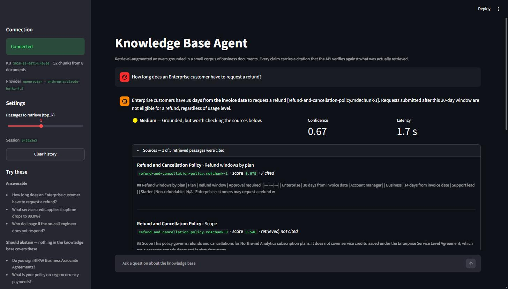

# Knowledge Base Agent — submission summary

The 2–4 page explanation the brief asks for. Deep reference material lives in
[`README.md`](README.md) (full API contract, runbooks, teardown),
[`EVALUATION.md`](EVALUATION.md) (11 graded questions) and [`docs/adr/`](docs/adr/)
(eleven architecture decision records).

**What it is:** a retrieval-augmented QA service. Infrastructure in AWS CDK (TypeScript), an
authenticated API on AWS, answers with citations the API verifies, and a local Streamlit
client that reaches it with a bearer token.

**Deployed and measured**, not only synthesized: 250 tests, 11 evaluation questions,
**~2.4 s** p50 across the evaluation set, **~$0.0015–0.002** per query, **~$2.10/month** of AWS cost against the $20 budget.

---

## 1 · Design explanation

```
Reviewer laptop                AWS us-east-1                          Third party
┌──────────────┐   Bearer    ┌──────────────────────────────────┐   ┌────────────┐
│  Streamlit   │────token───▶│ API Gateway REST                 │   │ OpenRouter │
│ HTTP+render  │             │   └─ Lambda authorizer ─▶ Secrets│   │ embeddings │
└──────────────┘             │   └─ Query Lambda                │──▶│ generation │
                             │        ├─ S3   index/ artifact   │   └────────────┘
                             │        └─ DynamoDB  query log    │
                             │   └─ Documents Lambda ─▶ S3 raw/ │
                             │ S3 event ▶ SQS ▶ Ingest Lambda   │
                             └──────────────────────────────────┘
```

**The shape:** the client holds a token and nothing else. Retrieval, prompting and model access
sit behind the API where they can be permissioned, logged and tested.

### Key tradeoffs

- **In-memory vector index instead of a vector database.** The index is a gzipped JSON artifact
  in S3, loaded into Lambda memory at cold start. OpenSearch Serverless is prohibited by the
  brief and bills continuous base capacity; a micro RDS would eat ~70% of a $20 budget.
  **Retrieval costs $0.00.** *Cost:* a full rebuild on every change, and a measured ceiling of
  **~13,300 chunks** — set by the ingest timeout, not by memory.
  ([ADR-01](docs/adr/), [ADR-11](docs/adr/0011-when-to-move-to-containers.md))
- **Exact cosine in pure Python, no FAISS or numpy.** 52 chunks × 512 dims scans in 3–5 ms
  against ~1,500 ms of generation. An ANN index would optimise 0.2% of latency while forcing a
  native dependency — and Docker — into every deployment. The query Lambda has **zero
  third-party dependencies**. ([ADR-02](docs/adr/))
- **API Gateway REST, not the cheaper HTTP API.** HTTP API returns a bare
  `{"message":"Forbidden"}` for a denied authorizer with no way to change it. Gateway Responses
  exist only on REST, and they are what make *every* error — 401 and 429 included — carry the
  documented envelope with a `request_id`. Price difference at this volume: **$0.006**.
  ([ADR-03](docs/adr/))
- **One stack, four constructs.** Cross-stack references become CloudFormation exports, and
  CloudFormation refuses to delete a stack whose exports are in use. For a reviewer who deploys
  and destroys once, that is friction with no benefit.
- **Lambda, not containers — and the line where that flips.** The brief's approach here is
  *"a Lambda-based API for a small scoped implementation, with clear notes on when you would
  move to containers."* Those notes are
  [**ADR-11**](docs/adr/0011-when-to-move-to-containers.md), derived by measurement: exactly one
  wall forces containers — a `torch`-class dependency, 529 MiB compressed against a 250 MiB
  unzipped limit. The 29 s ceiling, streaming, cold start, FAISS and concurrency all have
  cheaper Lambda-native fixes, and the cost crossover sits ~200× above this system's traffic.
- **The model provider sits behind an interface.** Forced by an incident: the AMCRO sandbox lost
  `bedrock-runtime` mid-project (`ValidationException: Operation not allowed`, an
  organisation-level block, not a model-access toggle). `MODEL_PROVIDER` selects OpenRouter or
  Bedrock. *Honest cost:* **retrieved passages now leave AWS** inside the prompt, and the
  Bedrock path is written against the documented API but could not be exercised.
  ([ADR-09](docs/adr/0009-model-provider-abstraction.md))

---

## 2 · Infrastructure

**One CDK stack** — `KbAgentStack`, TypeScript — composed of four L3 constructs. **91 resources.**

| Construct | What it provisions |
|---|---|
| `knowledge-base-storage` | S3 bucket (versioned, SSE, public access blocked), DynamoDB query-log table (on-demand, 30-day TTL) |
| `knowledge-base-seeder` | Ingest Lambda, deploy-time trigger, SQS queue + S3 event notification for auto-reindex |
| `query-api` | API Gateway REST, Lambda authorizer, query Lambda, documents Lambda, 6 Gateway Responses, request validator, stage throttling |
| `observability` | Log groups, CloudWatch dashboard, 3 alarms, SNS topic, AWS Budgets |

**AWS services provisioned:** API Gateway · Lambda · S3 · DynamoDB · SQS · Secrets Manager ·
CloudWatch (Logs, Metrics, Dashboard, Alarms) · X-Ray · SNS · IAM · AWS Budgets.

- **8 Lambda functions** in the template — **4 are the application's** (authorizer, query,
  documents, ingest); 4 are CDK's own custom-resource providers.
- **9 IAM roles, one per function, each least-privilege.** The query role can read `index/*`
  and nothing else — it cannot reach `raw/`. Every write the documents role can make is
  confined to `raw/`, so no authenticated call can replace the index artifact. **Three CDK
  assertions read the synthesized template and fail if that changes.**
- **Env-agnostic:** no `env` prop on the stack, so the same commit deploys to any account.
  Account-specific names resolve from `Aws.ACCOUNT_ID` at deploy time.
- **Reproducible synth:** byte-identical templates across runs, verified.
- **Deploy / destroy:** `cdk deploy` → working system in ~90 s, knowledge base seeded from
  version-controlled `sample-docs/`. `cdk destroy` removes everything the stack owns.

```bash
npm run install:infra                       # CDK dependencies
npm run deploy -- -c prefix=kbagent-<initials>   # vendors pypdf, then deploys
```

`npm run deploy` runs `build:lambda` first — that vendors `pypdf` as Linux `cp312` wheels for
the ingest Lambda, without which the corpus PDF fails to parse. Calling `cdk deploy` directly
skips it. In a shared account add `-c cloudWatchRole=false`; in a fresh one run
`npm --prefix infra exec -- cdk bootstrap` once per account and region. The first deploy cannot seed the index (CDK creates the provider-key
secret in the same deployment), so the README's two follow-up commands finish the job.

---

## 3 · API contract

**Authentication:** a bearer token in `Authorization`, checked by a **Lambda TOKEN authorizer**
before any business code runs.

- A `validationRegex` on the authorizer rejects malformed tokens **at the gateway**, so a
  garbage header never reaches Lambda.
- The comparison uses `hmac.compare_digest` — constant time, no early exit on first mismatch.
- The token is generated by CDK into **Secrets Manager** and never appears in source, in the
  CloudFormation template, or in logs.
- Policy cache: 5 minutes. Stage throttling caps the API at 5 rps.

| Endpoint | Purpose |
|---|---|
| `POST /query` | Ask a question. `{question, top_k?, style?}` |
| `GET /health` | Liveness plus index state — `kb_version`, `chunk_count`, `document_count` |
| `GET /documents` | List the corpus, and report drift between `raw/` and the index |
| `POST /documents` | Returns a **presigned S3 POST**; the file never transits the API |
| `DELETE /documents/{id}` | Remove a document and trigger a rebuild (`202`) |

**Response schema** (`POST /query`) — `answer`, `confidence`, `grounding`, `sources[]`,
`metadata`. Every source carries `document_id`, `chunk_id`, `section`, `score` and **`cited`**.
`metadata` carries `request_id`, `top_score`, `retrieval_ms`, `generation_ms`, `latency_ms`,
token counts, `estimated_cost_usd` and the three `confidence_components`.

**Errors** are uniform — `{error, message, request_id}` — for 400, 401, 403, 404, 429, 500 and
504. 401 means *no or malformed token*; 403 means *a well-formed token that is wrong*.

**Local Streamlit connection flow:**

1. `aws secretsmanager get-secret-value --secret-id <prefix>-dev/api-token` — read the token.
2. Put `API_BASE_URL` and `API_TOKEN` in `client/.streamlit/secrets.toml` (or the environment;
   the environment wins, with an on-screen fallback if neither is set).
3. `streamlit run client/streamlit_app.py`.
4. The client calls `GET /health` on load — the sidebar shows **Connected**, the `kb_version`
   and the active model — then `POST /query` per question. It holds **no AWS credentials and
   no model key**.

---

## 4 · AI / RAG behaviour

**Ingestion** (deploy time, and again on any change under `raw/`, debounced 60 s through SQS):

- **Parsing** — Markdown split on its own heading structure; PDF through `pypdf`. The sample
  corpus resolves to **44 Markdown segments + 2 PDF page segments**.
- **Chunking** — 800 characters with 120 of overlap, never crossing a parsed segment boundary.
  Ids are stable and addressable: `enterprise-sla.md#chunk-2`. **52 chunks from 8 documents.**
- **Embeddings** — `text-embedding-3-small` at 512 dimensions, batched, and **re-normalised
  locally whatever the provider returns** (OpenRouter is a router; the guarantee is ours).
  Bought once at ingest, never per query. A chunk ceiling refuses an oversized corpus *before*
  spending on it.

**Retrieval** — exact cosine over the in-memory index. `top_k` defaults to 5, max 10. A
per-document cap, `max(3, ceil(0.05 × chunks))`, stops one long document from crowding out
every other source.

**Prompting** — `temperature=0`. Retrieved passages are **XML-escaped** before entering the
prompt, so document text cannot close a tag and impersonate an instruction. The prompt requires
a citation per claim and forbids outside knowledge. A `style` parameter selects `standard` or
`simple` server-side, where the prompt is testable.

**Grounding and abstention** — two independent paths:

- `top_score_below_floor` — nothing retrieved clears `RELEVANCE_FLOOR` (0.40). The system
  answers *"I could not find information about that"* **without calling the model at all**:
  `generation_ms: 0.0`, cost **$0.00**.
- `model_reported_insufficient_context` — the model emits the `INSUFFICIENT_CONTEXT:` sentinel.

**Source citations** — the model emits `[doc#chunk-N]`; the API parses them back and **resolves
each against the retrieved set**. A citation naming a passage retrieval never returned is
dropped and reported in `dropped_citations`. Each source is labelled `cited: true|false`, so a
reviewer sees what was retrieved *and* what was actually used.

**Confidence** — `0.50·retrieval_strength + 0.25·consensus + 0.25·citation_coverage`, exposed
component by component. The reference prototype's 10% keyword-overlap term was **deliberately
removed**: it rewards echoing the question's vocabulary, which is fluency, not grounding.

**Stated honestly:** the score measures *retrieval quality, not factual correctness*.
`EVALUATION.md` records one wrong answer out of eleven where retrieval was perfect and the
system reported `confidence 0.75, grounding: high`. A verification loop that catches and
corrects it was built and measured on a branch ([ADR-0010](docs/adr/0010-verification-loop-langgraph.md)).

---

## 5 · AI tools usage

Built with **Claude (Claude Code)** as a pair-programming assistant throughout — CDK constructs
and Lambda handlers, the sample documents and test suites, running AWS commands and interpreting
failures, and analysing evaluation output.

What it was *not* used for: accepting output unverified. Several of its own claims were wrong
and were caught by testing them:

- It documented that CDK creates an "empty" secret. `new Secret()` with no props generates a
  **random value**, which the ingest Lambda would have sent to the provider — a 401 and a
  full stack rollback. A test written for another purpose caught it.
- It claimed one `request_id` spans five systems. False for X-Ray, which indexes by its own
  trace id — found while verifying the claim rather than restating it.
- It diagnosed a missing auth header from an HTTP 401. A deliberately invalid key produced the
  identical error; the real cause was a **truncated** key.

**The pattern worth reporting: most defects surfaced when verifying a claim, not when writing
it.** Model output was treated as a draft requiring evidence.

---

## 6 · Evidence — one run, end to end

Local Streamlit client against the deployed API, account `908764745394`, `us-east-1`.



**The question, as asked in Streamlit:** *"How long does an Enterprise customer have to request
a refund?"*

**The AWS API request the client sent:**

```bash
curl -s -X POST "https://b8ftgtvo00.execute-api.us-east-1.amazonaws.com/dev/query" \
  -H "Authorization: Bearer $API_TOKEN" \
  -H "Content-Type: application/json" \
  -d '{"question":"How long does an Enterprise customer have to request a refund?","top_k":5}'
```

**The structured response** (abridged — full `sources[]` below):

```json
{
  "answer": "Enterprise customers have **30 days from the invoice date** to request a refund [refund-and-cancellation-policy.md#chunk-1]. Requests submitted after this 30-day window are not eligible for a refund, regardless of usage level.",
  "confidence": 0.67,
  "grounding": "medium",
  "metadata": {
    "request_id": "5fd7e5a8-b92c-47d8-9411-90bfdf7833a2",
    "retrieval_strategy": "in_memory_cosine_topk",
    "chunks_searched": 52,
    "top_score": 0.6793,
    "retrieval_ms": 216.9, "generation_ms": 1469.8, "latency_ms": 1686.7,
    "input_tokens": 1232, "output_tokens": 60,
    "estimated_cost_usd": 0.001532,
    "confidence_components": {
      "retrieval_strength": 0.6982, "consensus": 0.7689, "citation_coverage": 0.5
    },
    "dropped_citations": []
  }
}
```

**The retrieved sources** — five returned, one cited:

| `chunk_id` | score | `cited` |
|---|---|---|
| `refund-and-cancellation-policy.md#chunk-1` | 0.6793 | ✅ |
| `refund-and-cancellation-policy.md#chunk-0` | 0.5460 | — |
| `refund-and-cancellation-policy.md#chunk-3` | 0.5099 | — |
| `security-and-data-handling.md#chunk-3` | 0.4655 | — |
| `enterprise-sla.md#chunk-2` | 0.4109 | — |

Confidence lands at **0.67, not higher**, and the components say why: retrieval was strong
(0.70) but only one passage was cited, so `citation_coverage` is 0.50. The client renders that
as *"Medium — grounded, but worth checking the sources below."* **A confident-sounding answer
does not get a confident score.**

The screenshot above and the JSON are the same exchange: at `temperature=0` the run reproduces
two days and one reindex later, to the same answer text, the same 0.67, and 1.69 s against the
1.7 s on screen.

### Two more behaviours, same deployment

**Multi-document synthesis** — *"What is the response time commitment for a Severity 1 incident,
and who must be notified?"* → `confidence 0.84`, `grounding: high`, citing **two different
documents** (`support-escalation-runbook.md` and `enterprise-sla.md`), 3 of 5 passages cited,
`citation_coverage: 1.0`, 2.46 s.

**Abstention** — *"Is the platform HIPAA compliant?"* → nothing in the corpus mentions HIPAA.
`top_score 0.3334` falls below the 0.40 floor:

```json
{ "answer": "I could not find information about that in the knowledge base.",
  "confidence": 0.23, "grounding": "insufficient_context", "sources": [],
  "metadata": { "abstained": true, "abstain_reason": "top_score_below_floor",
                "generation_ms": 0.0, "estimated_cost_usd": 0.0, "latency_ms": 203.4 } }
```

The model was **never called**: the system declines in 203 ms for **$0.00** rather than paying
to generate a guess.

**Unauthenticated call** — no token:

```json
{ "error": "unauthorized", "message": "Missing or malformed authorization token.",
  "request_id": "20dbb040-b06b-4af2-9139-78cde0426477" }
```

`HTTP 401`, in the documented envelope with a correlatable `request_id` — the Gateway Response
that REST makes possible and HTTP API does not.
