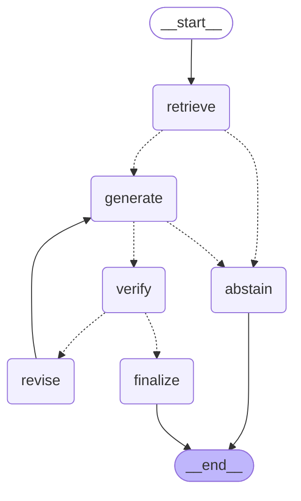

# ADR-0010 — Answer verification as a bounded loop, orchestrated by LangGraph behind a flag

**Status:** **Partially accepted** — the verification loop is adopted and lands on `main`;
LangGraph is **rejected**. Settled 2026-09-11 by the pre-registered experiment; the numbers
are in `EVALUATION.md`.

**Outcome in one line:** Q2 caught and corrected 3/3, zero false failures, cost 2.42×, warm
latency +386 ms — and graph/loop parity found **zero** differences, so the rule's requirement
to name one behaviour the plain loop did not reproduce could not be met. The framework is
cheap (+28 ms cold start, not the +1,000–2,000 ms this ADR predicted) and adds nothing
observable, which is a better reason to drop it than the one predicted.
**Branch:** `experiment/langgraph-verify`, deployed beside `main` under the prefix `kbagent-lg`.

## Context

`EVALUATION.md` records one factually wrong answer in eleven, and it is the most important
result in the project:

> **Q2** — *What service credit applies if uptime drops to 99.0%?* The answer said no credit
> applies. The correct answer is 10%. Retrieval was **perfect**: top score 0.753, correct
> document, correct section, correctly cited. The system reported `confidence: 0.75,
> grounding: high`.

Two things about that failure set the problem for this decision.

**No similarity signal can catch it.** Every input to the confidence score was excellent. The
error was a boundary inversion — reading *below 99.0%* where the table said *at or above
99.0%* — committed during generation, over a passage the retriever had already found. The
score measures retrieval quality, and retrieval was not what failed.

**The chunking theory is wrong, and was checked.** The obvious hypothesis was that the SLA
table had been split by character count. It had not: `enterprise-sla.md#chunk-2` is one
786-character chunk holding the intro sentence, the header row and all three credit rows, and
`evaluation/results.json` shows the model cited exactly that chunk. **No chunker, node
hierarchy or retriever changes what the model read.** That is why the two retrieval-centred
framework proposals were rejected (see the panel summary below) — their mechanisms cannot
reach this failure.

That leaves two things that can, and `EVALUATION.md` already names both.

## Options

### 1 · The prompt change — measured, free, and an avoidance rather than a catch

The `simple` answer style gets Q2 **right 3 runs out of 3** while `standard` gets it wrong
3 out of 3, at `temperature=0`. The full evaluation under both styles (`evaluation/ab-styles.json`)
shows Q2 is the *only* question where they differ, and the simple style degrades nothing.

It is real, it costs nothing, and it belongs on `main` independently of this branch. But it
avoids the error; it does not detect one. The confidence score would still have read 0.75.

### 2 · A second pass that reads the answer against the passages — the option that catches

`EVALUATION.md`'s improvement item asks for exactly this: *"a second pass asking the model to
check each claim against the cited passage would catch a boundary error that no similarity
metric can see."* This ADR builds it.

**It was gated on evidence before any orchestration code existed.** `scripts/probe_verifier.py`
sends the recorded wrong answer and the recorded correct answer to the same model
(`claude-haiku-4.5`) behind the verifier prompt, five times each, against the real chunk
recomputed through the ingest splitter:

| Answer under test | Runs | Verdict |
|---|---|---|
| The recorded **wrong** standard answer | 5 | **fail 5/5** |
| The recorded **correct** simple answer | 5 | **pass 5/5** |

The issue sentence was byte-identical across all five failures:

> *"The answer claims no credit applies at 99.0%, but the table explicitly states 'at or above
> 99.0%' qualifies for 10% credit, meaning 99.0% is included."*

The checker names the boundary. It does not merely disagree — it says which comparison was
inverted, which is what makes a reviewer note worth feeding back into a revision.

A same-model checker catching a same-model error is the surprising part, and the reason it
works is that checking is a different task from answering: the verifier is shown one claim
and one passage and asked to quote the span that supports it, with the literal reading of
boundary words spelled out. It is not asked to be cleverer, only to be narrower.

### 3 · The orchestrator — and why the framework is a variable, not an assumption

Generate → verify → revise → verify is a state machine with a cycle and a bound. LangGraph
models exactly that. It is also, honestly, about thirty-five lines of `while` loop.

Three framework proposals were designed and scored by three independent judges (packaging
pragmatist, brief-scope reviewer, RAG researcher):

| Framework | Judges' total | Why |
|---|---|---|
| **LangGraph** | **92** | The only mechanism that reaches failure A; smallest footprint |
| LangChain classic | 57 | Bundles a provider rewrite unrelated to any measured failure |
| LlamaIndex | 44 | Its mechanism touches neither failure; heaviest footprint |

Measured footprints, installed as `manylinux2014_x86_64` / cp312 wheels from this Windows
machine — estimates were not accepted:

| Candidate | Unzipped | Note |
|---|---|---|
| LlamaIndex | **237.9 MB** | numpy + OpenBLAS 67 MB, SQLAlchemy, Pillow, nltk, networkx |
| LangChain | 214.7 MB | numpy again, to compute cosines over 52 vectors |
| **LangGraph** (`langgraph` + `langchain-core` only) | **47.7 MB pruned** | 38 distributions, 11 `.so`, all cp312 x86_64, no numpy |

## Decision

**Build the verification loop. Ship LangGraph as the orchestrator behind `ORCHESTRATOR`,
with a plain `while` loop over the identical nodes as the alternative value.**

- `services/query/rag/nodes.py` — `retrieve`, `generate`, `verify`, `revise`, `abstain`,
  `finalize`, their routers, and `run_loop`. **Zero framework imports.**
- `services/query/rag/graph.py` — the only file that imports `langgraph`, and it is imported
  lazily, inside the branch that needs it. With `ORCHESTRATOR=loop`, nothing in the process
  loads the dependency. Verified both ways.
- `services/query/rag/verifier.py` — stdlib only. The prompt, the message builder, and a
  `parse_verdict` that **fails closed**: any claim whose status is not `supported` forces
  `fail`, whatever the model wrote in its own verdict field.

The framework is therefore a measurable variable rather than a commitment. Parity between the
two runners is a unit test today and a live measurement in the protocol.



## Consequences

**A failed verification pulls `grounding` to `low`.** Not to an error, and not to an
abstention: the answer is still returned, with the label the client already renders as
*"verify against the sources before relying on this"* — which is precisely the right advice
for an answer a second reading disagreed with. `metadata.verification` carries the verdict,
the issue sentence, the rounds and the claims checked, so the judgement is auditable rather
than implied by a label.

**The cost roughly doubles**, from ~$0.0033 to ~$0.0066 per answered query, and ~$0.010 when
a revision fires. `metadata.estimated_cost_usd` now sums every model call in the request
rather than reporting the last generation, because a number that understates the bill by half
is worse than no number against a $20 ceiling.

**Warm latency grows by one model call**, measured at 1.9–3.1 s in the probe. A deadline
guard reserves `VERIFY_DEADLINE_RESERVE_MS` from the remaining Lambda time and **skips** the
pass rather than starting one it cannot finish, so verification can never be the reason a
request times out.

**The query Lambda is no longer dependency-free**, and this reverses the strongest property
of ADR-02 on this branch. 47.7 MB of vendored Linux wheels, shipped inside the existing
`Code.fromAsset` zip exactly as `pypdf` already is for ingest — no Layer, no Docker, no
container image. `main`'s cold start measures **574 ms mean** against a code asset that rounds
to 0.0 MB; the branch's is one of the numbers the experiment produces.

**`langsmith` is imported eagerly by `langchain_core.tracers`**, whether or not it is used,
and it drags in `zstandard` — 22.8 MB, nearly half the closure. `LANGSMITH_TRACING=false` and
`LANGCHAIN_TRACING_V2=false` are pinned in the function environment and asserted by a CDK
test, because a stray `LANGSMITH_API_KEY` would otherwise ship user questions and retrieved
passages to a second third party. That is a security assertion, not a tidiness one.

**Retrieval is untouched**, deliberately. The scaled per-document cap that fixes the *other*
measured failure landed as a separate change so both stacks share it, which gives the
comparison a built-in control: `top_score` must match `main` within 1e-3 on every question,
or the branch changed something it promised not to.

## A bug the branch found in `main`

Deploying a second stack into an account that already owned the API Gateway CloudWatch role
failed at synth:

```
CloudWatchRoleEnabledCloud: 'cloudWatchRole' must be enabled for
'cloudWatchRoleRemovalPolicy' to be applied.
```

CDK refuses a removal policy for a resource the stack does not create, and `-c
cloudWatchRole=false` is exactly what a shared account needs — the flag the README documents
for the AMCRO sandbox. **The documented sandbox deployment command would have failed**, and
nothing would have revealed it until someone ran it under time pressure. The removal policy
is now applied only when the role is ours to create, and a CDK assertion pins both halves:
that `cloudWatchRole=false` synthesizes, and that it genuinely declines the singleton.

Two smaller things surfaced with it. Stale `tsc` output (`infra/**/*.js`) left on disk was
shadowing the TypeScript under jest, so the suite was testing compiled code from before the
fix — the reason those artifacts do not belong in the tree at all. And the experiment's own
value showed up before any measurement: deploying a second stack is what exercised the
shared-account path for the first time.

## How this decision gets settled

The experiment is pre-registered in `EVALUATION.md`: four configurations (`M` main, `L0`
packaging only, `L1` the graph, `L2` the same nodes under the plain loop) toggled by
environment variable on one deployment, so packaging, verification and framework are three
separate numbers rather than one confounded one.

The thresholds were written before the runs. Adopt the loop if Q2 is caught 3/3, false
failures stay at or below 1 in 27 correct answers, no correct answer is revised into a wrong
one, cost stays under 2.5×, and warm median grows by no more than 3 s. Adopt the *framework*
only if the loop is adopted **and** graph/loop parity holds **and** the framework's own
cold-start cost is under 300 ms **and** this ADR can name one behaviour the plain loop did
not reproduce.

The honest prediction, recorded here before the numbers exist: **the loop earns its place and
the framework does not.** If that is how it lands, the loop is cherry-picked onto `main` with
`ORCHESTRATOR=loop` as the only value, the vendor directory is deleted, and the query Lambda
returns to zero third-party dependencies with ADR-02 intact.

Writing that prediction down is the point. A result that can only confirm the choice already
made is not an experiment.
